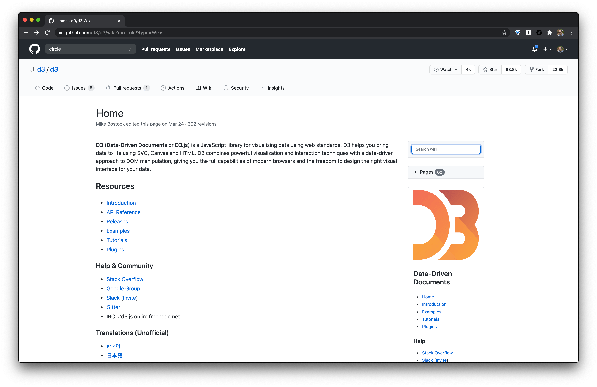

# 🔍 GitHub Wiki Search

Chrome extension for adding a simple search box to GitHub wikis.

👉 [Download Chrome Extension](https://chrome.google.com/webstore/detail/github-wiki-search/neadealkfeligebmmolcibhbcdfplhhg).

👉 [Download Firefox Extension](https://addons.mozilla.org/addon/github-wiki-search/).

## ⭐️ Features

- Adds a simple search form to the top of GitHub wikis.
- Links to that repo's search page (e.g., `/search?type=Wikis`).

For more details on how to search GitHub wikis, check out the docs: [GitHub: Searching wikis](https://docs.github.com/en/free-pro-team@latest/github/searching-for-information-on-github/searching-wikis).

## 👀 Alternatives

- [Wiki Search for GitHub](https://chrome.google.com/webstore/detail/wiki-search-for-github/gdifdhnjmjaidbajhapmbcbnoocoeooc)

## 📝 [Changelog](changelog.md)
